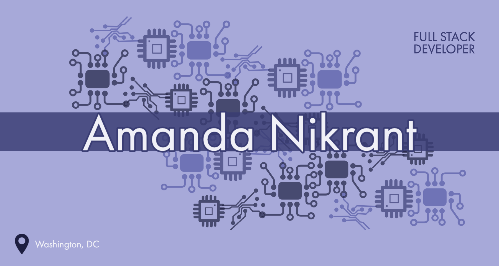

 
 👋 Hello!
------
I am Full stack software engineer with experience in Ruby on Rails, React, and Javascript. I have a background in quality control, and an eye for details and logic. Trained in Agile and Lean/SixSigma. I am passionate about learning, inclusive environments, and community outreach!
Feel free to reach out over on [LinkedIn](https://www.linkedin.com/in/amanda-nikrant/ "Amanda Nikrant's LinkedIn").

✍ Blogs & Writing
------
I enjoy delving into new coding topics and writing about my current projects in my blog over at [Medium.com](https://ajnikrant.medium.com/ "Amanda Nikrant's Blog").

🔧 Languages & Technologies
------

📈 Github Stats
------

📫 How To Reach Me
------
Feel free to reach out 
